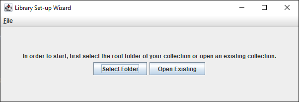
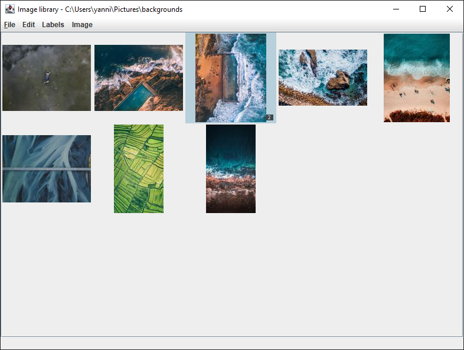
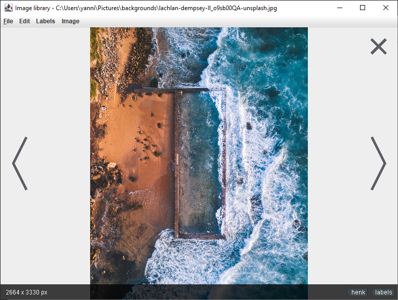

# image-viewer
Image viewer and library manager

This tool was build from a need to quickly search an organized collection of images. While the Windows file explorer does an admiral job, sorting can be slow, and you need an extra tool for opening the image. Since it is an extra tool, navigation when viewing other images does not necessarily correspond with the order of images you just had.

Using the image viewer you have both browsing and viewing in a single application. Moreover, because all data is in a library file, you do not have to wait for re-indexing or rebuilding of caches to start.

## Features:
* Create a collection of images from a folder
* Annotate images with labels
* Fast loading
* Searching based on the labels

## Screenshots

